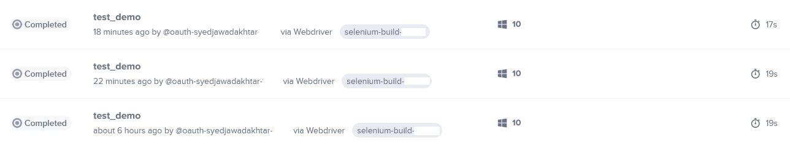

# Testing Profilence Website

## Table of Contents

- [Tools & Installation](#tools--installation)
- [Test descriptions](#test-descriptions)
- [Timeline](#timeline)
- [Future Work](#future-work)

### Tools & Installation

Tools used: Python, Selenium, Chrome browser, X-Path Finder (Chrome Extension).
`modules.py` contains all the header files required for running the test scripts.

Assuming you have Python, Chrome and pip installed already on the system. To install Selenium in your python environment:

```pip install selenium```

I have explored [SauceLabs](https://saucelabs.com/) for test visualizations.

### Test descriptions

#### TEST 1: If the website is of Profilence

- Profilence website is opened
- Title of the webpage contains Profilence or not

#### TEST 2: Subscribing to the newsletter using a dummy email ID is successful or not

- Accepts cookies, to enable subscribing to newsletters
- Enters valid email ID: `standard_user@gmail.com`
- Checks terms and conditions check box
- Checks if the 'Thanks you' message is showen

#### TEST 3: Checking if 'Learn More' button under 'Why Us' section leads to solutions page

- 'Learn More' button is found and clicked
- Title of the next page is checked. Using Beautiful Soup to parse HTML
- Also the current page URL is also checked

#### TEST 4: Checking if 'Demo Request' button works on the homepage

- 'Demo Request' button clicked is searched and clicked
- New page title and URL are checked

#### TEST 5: Check Navbar works

- Top corner navigation bar is clicked
- Total number of menu items is counted. 1. Home, 2. Industries, 3. Solutions, 4. News, 5. Company and, Demo Request  

### Testing instructions

You can straight away test by:

```python test_<test_number>.py```

### SauceLabs output

I was not able to try the whole functionality of this tool but these are a few screenshots which show the capability of SauceLabs and it is easy integration into Selenium testing.

|  |
|:--:|
| This shows the history of tests for date and status. Orange is "errored" and "grey" is completed |

|  |
|:--:|
| This shows the summary of the tests in a pie chart form. It also shows test breakdown with respect to browser used, OS, framework and devices  |

|  |
|:--:|
| The tests completed when testing profilence.com with the time taken to complete each test on Windows 10|

### Timeline

|Tasks|Time taken|
|:--------------------------------------: |:----|
|Learning Selenium and SauceLabs |2.5 hrs|
|Making 5 tests for Profilence.com|4.6 hrs|
|Documentation|0.75 hrs|
|Total Time|7.85 hrs|

Started working around 1.00 of 6th May and ended around 22.00 same day with all the above tasks.

### Future work

- Make it run thousands of times.
- More robust testing scripts for dynamic websites
- Visualizations and time complexity analysis using more robust tools